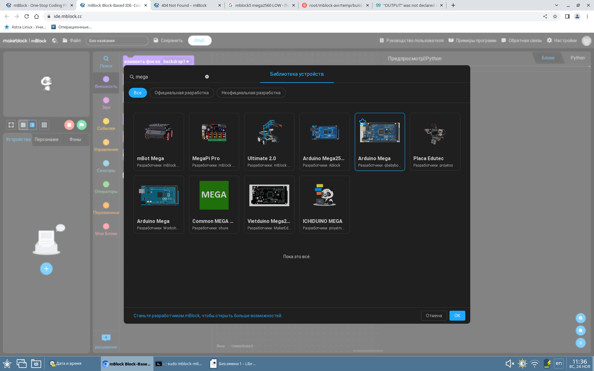
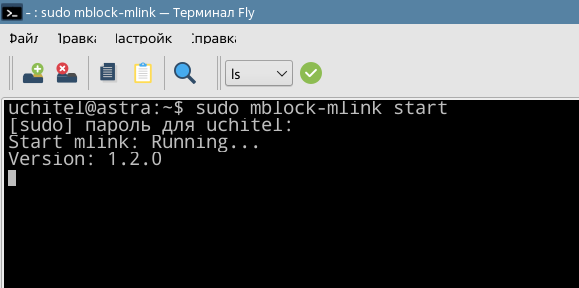
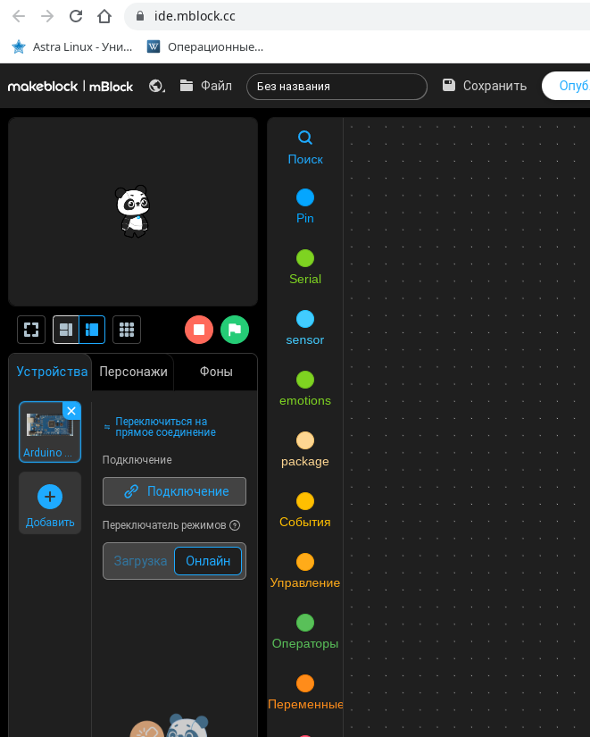
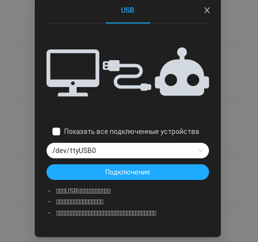
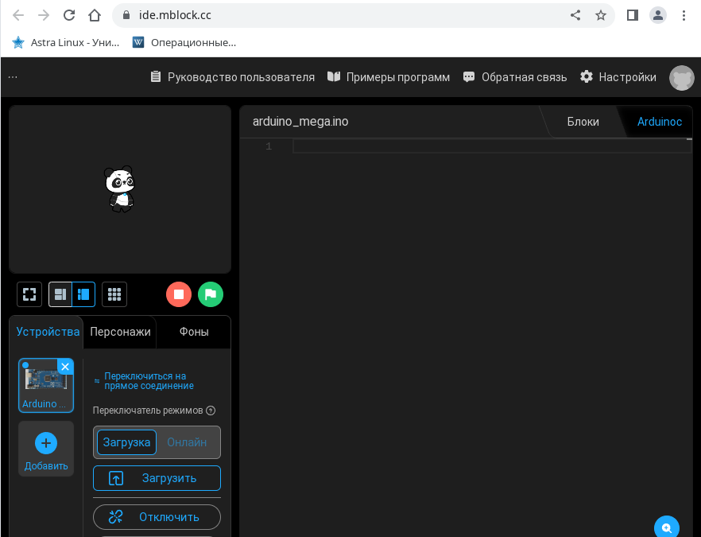

# Лабораторная работа 1. Светодиод

1. Идем в браузере Chrome на https://ide.mblock.cc/
2. Добавляем устройство Arduino Mega (разработчики qbabybo…)

3. Подключаем утройство к ПК
4. Подключение:
    - Запускаем mlink из терминала
    
        ```
        sudo mblock-mlink start
        ```

        

    - Жмем "Подключение"

        

    - Выбираем устройство usb0 и жмем "Подключение"

        
    
    - Переключаем "Загрузка/Онлайн" на "Загрузка". "Блоки" на "Arduinoc" (правый верхний угол)

        
    
5. Вставляем код программы и жмем "Загрузить". После загрузки программы будет моргать LE02 светодиод (D23)

    ```
    #include<Arduino.h>

    int pin = 23;
    void setup()
    {
        pinMode(pin, OUTPUT);
    }

    void loop()
    {
        digitalWrite(pin, HIGH);
        delay(100);
        digitalWrite(pin, LOW);
        delay(900);
    }

    ```